# Genesis — Architecture Overview

**What Genesis is:** A continuously-running autonomous learning system that
builds its own knowledge graph, follows its own curiosity, and expresses what
it understands in language proportional to how well it knows something.
It is not an LLM. It has no pretrained weights. Everything it knows came from
text it has actually read.

---

## System Layers (Brooks 1986 Subsumption)

Each layer is always present. Higher layers add capability; they never remove
lower ones. If a higher layer fails, everything below keeps running.

```
┌──────────────────────────────────────────────────────────┐
│  Layer 6 — Voice                                         │
│  Intent-aware conversation · Progressive expression      │
├──────────────────────────────────────────────────────────┤
│  Layer 5 — Curriculum                                    │
│  Stage gating · Adaptive input stream                    │
├──────────────────────────────────────────────────────────┤
│  Layer 4 — Cognition                                     │
│  Inference · Contradiction · Consolidation · Belief      │
├──────────────────────────────────────────────────────────┤
│  Layer 3 — Ingestion                                     │
│  Curiosity engine · Web browser · WordNet · Gutenberg    │
├──────────────────────────────────────────────────────────┤
│  Layer 2 — Processors                                    │
│  Text · Numeric · Pattern                                │
├──────────────────────────────────────────────────────────┤
│  Layer 1 — Memory                                        │
│  Working memory · Long-term store · Relation graph       │
├──────────────────────────────────────────────────────────┤
│  Layer 0 — Survival OS          ← always running        │
│  Resource manager · Directives · Resilience              │
└──────────────────────────────────────────────────────────┘
```

---

## Full Data Flow Diagram

```mermaid
flowchart TD
    USER(["👤 User / External Input"])

    subgraph SURVIVAL ["Layer 0 — Survival OS"]
        RM["ResourceManager\n──────────────\nIN: CPU time, RSS memory\nOUT: energy 0–1, throttle level\n(NONE/LIGHT/MODERATE/CRITICAL/EMERGENCY)"]
        DE["DirectiveEngine\n──────────────\nIN: system stats each cycle\nOUT: directive pressure\n(PERSIST · MAINTAIN · ACQUIRE · GROW)"]
        EL["ResilienceMonitor + ErrorLog\n──────────────\nIN: any caught exception\nOUT: structured error records\n(errors are data, never dropped)"]
    end

    subgraph MEMORY ["Layer 1 — Memory"]
        WM["WorkingMemory\n──────────────\nIN: processed items + heat scores\nOUT: top-k context terms for attention\n100-item bounded RAM, heat-based eviction"]
        LTS["LongTermStore (SQLite + FTS5)\n──────────────\nIN: memories from working memory\nOUT: BM25-ranked search results\nWrite-through — crash-safe, total retention"]
        RG["RelationGraph\n──────────────\nIN: typed triples from TextProcessor\nOUT: paths, causal chains, concept stats\nTypes: IS_A CAUSES CONTAINS REQUIRES\nPREVENTS CONTROLS ENABLES AFFECTS"]
        ARC["ArchiveStore\n──────────────\nIN: high-significance memories\nOUT: domain-tagged cross-session refs\nSignificance = prediction error magnitude"]
    end

    subgraph PROC ["Layer 2 — Processors"]
        TP["TextProcessor\n──────────────\nIN: raw prose text\nOUT: typed relation triples\n+ claim classification\n+ named entity detection"]
        NP["NumericProcessor\n──────────────\nIN: numeric data streams\nOUT: interoception signals\n(energy, memory pressure, cycle counts)"]
        PP["PatternProcessor\n──────────────\nIN: numeric sequences\nOUT: pattern type + confidence\n(arithmetic, geometric, Fibonacci...)"]
    end

    subgraph INGEST ["Layer 3 — Ingestion"]
        CE["CuriosityEngine\n──────────────\nIN: relation graph gaps\n+ spreading activation priming\nOUT: priority topic list\n(low-coverage concepts ranked by\nprediction error + directive weight)"]
        KF["KnowledgeFeeder\n──────────────\nIN: priority topics from curiosity\nOUT: text chunks to Orchestrator\nCoordinates all sources below"]
        WN["WordNetDictionary\n──────────────\nIN: concept name\nOUT: definition sentence\nMost-frequent-sense disambiguation\nAlways available offline"]
        GB["GutenbergFetcher\n──────────────\nIN: topic name\nOUT: book passage (next unread chunk)\nReturns to same book across sessions"]
        CORP["OfflineCorpusFetcher\n──────────────\nIN: topic name\nOUT: NLTK corpus passages\nOffline fallback when Gutenberg unavailable"]
        BR["GenesisBrowser (M25)\n──────────────\nIN: search query + active concepts\nOUT: web page text + followed links\nPlaywright headless · robots.txt · rate limit\nPaywall detection → access request queue\nLink scoring via spreading activation"]
    end

    subgraph COGNITION ["Layer 4 — Cognition"]
        IE["InferenceEngine\n──────────────\nIN: observed relation triples\nOUT: inferred triples with compound conf\nTransitive chains: wolves→deer→overgrazing\n→ wolves CONTROLS overgrazing (derived)"]
        CL["ContradictionLog\n──────────────\nIN: new relation triples\nOUT: contested belief records\nDetects: A CAUSES B vs A PREVENTS B\nNever overwrites — holds uncertainty"]
        CON["ConsolidationEngine (sleep)\n──────────────\nIN: full memory + relation state\nOUT: first-person reflection → memory\nSalience = prediction error + recency\n+ connectivity + contradiction signal\nRuns periodically between sessions"]
        SA["SpreadingActivation\n──────────────\nIN: current attention terms\nOUT: activation scores per concept\nBFS with decay-per-hop\nPrimes graph-adjacent memories"]
        BR2["BeliefRevision\n──────────────\nIN: contested beliefs + new evidence\nOUT: REVISE / RESIST / TENSION decision\nCorroboration ledger tracks sources\nBeliefs demoted to floor, never deleted"]
        PT["PatternTransfer\n──────────────\nIN: relation graph after reflection\nOUT: structural analog pairs\nJaccard similarity over role fingerprints\n(REGULATOR / MEDIATOR / OUTCOME...)"]
    end

    subgraph CURRICULUM ["Layer 5 — Curriculum"]
        CUR["CurriculumEngine\n──────────────\nIN: memory + relation stats\nOUT: current stage gate\nFOUNDATION → RELATIONS → REASONING → OPEN\nAdvances when readiness thresholds met"]
        ADS["AdaptiveStream\n──────────────\nIN: attention window from working memory\nOUT: next input item (attention-weighted)\n30% diversity floor prevents monoculture\nDirective items scored 2×"]
    end

    subgraph VOICE ["Layer 6 — Voice"]
        GV["GenesisVoice\n──────────────\nIN: user text + full knowledge state\nOUT: grounded natural language reply\nStage 0: silent on unknown\nStage 1: echoes retained prose\nStage 2: composes from prose + relation\nStage 3: weaves prose + inference chain\nOn-demand learning wired here (M24)"]
    end

    subgraph ORCH ["Layer 7 — Orchestrator (hypervisor)"]
        O["Orchestrator\n──────────────\nIN: any input + survival state\nOUT: dispatched to correct processor\nGates every operation on survival.can()\nCoordinates all layers each cognitive cycle"]
    end

    %% User ↔ Orchestrator
    USER -->|"text / numeric input"| O
    GV -->|"natural language reply"| USER

    %% Orchestrator → Processors
    O -->|"text input"| TP
    O -->|"numeric stream"| NP
    O -->|"numeric sequence"| PP

    %% Processors → Memory
    TP -->|"typed triples"| RG
    TP & NP & PP -->|"processed items"| WM
    WM -->|"write-through"| LTS
    WM -->|"high-significance items"| ARC

    %% Memory → Cognition
    RG -->|"all relations"| IE
    IE -->|"inferred triples"| RG
    RG -->|"new triples"| CL
    CL -->|"contested pairs"| BR2
    BR2 -->|"revised confidence"| RG
    WM -->|"context terms"| SA
    SA -->|"activation boost"| LTS
    LTS & RG & IE & ARC -->|"full knowledge state"| CON
    RG -->|"post-reflection graph"| PT
    PT -->|"analog curiosity gaps"| CE

    %% Cognition → Memory
    CON -->|"reflection text → memory"| LTS
    CON -->|"salient concepts"| CE

    %% Curiosity → Ingestion → Orchestrator
    RG -->|"graph coverage map"| CE
    SA -->|"primed concepts"| CE
    CE -->|"priority topics"| KF
    KF -->|"definitions"| WN
    KF -->|"book passages"| GB
    KF -->|"corpus passages"| CORP
    KF -->|"web + discovered links"| BR
    WN & GB & CORP & BR -->|"text chunks"| O

    %% Curriculum
    LTS & RG -->|"readiness stats"| CUR
    CUR -->|"stage gate (OPEN releases)"| ADS
    WM -->|"attention window"| ADS
    ADS -->|"next input item"| O

    %% Survival OS
    RM -->|"energy + throttle"| O
    O -->|"cycle stats"| DE
    DE -->|"pressure signal"| O
    O -->|"caught exceptions"| EL

    %% Voice ← Knowledge
    LTS & RG & IE & CON -->|"knowledge for expression"| GV
    O -->|"user input"| GV
    GV -->|"on-demand learn request"| O
```



---

## Component Reference

### Layer 0 — Survival OS

| Component | File | What it does |
|---|---|---|
| ResourceManager | `src/survival/resource_manager.py` | Samples CPU+RSS every tick. Maps to energy (0–1) via EMA smoothing. Drives five throttle levels. |
| DirectiveEngine | `src/survival/directives.py` | Tracks four hardwired drives: PERSIST (stay alive), MAINTAIN (memory quality), ACQUIRE (learn), GROW (expand knowledge). |
| ResilienceMonitor + ErrorLog | `src/survival/resilience.py` | `safe_call()` wrapper — every exception becomes a structured ErrorRecord, never a crash. |

**Throttle levels and capability gates:**

| Level | Energy | Capabilities removed |
|---|---|---|
| NONE | ≥ 0.80 | All active |
| LIGHT | ≥ 0.60 | Pattern processor offline |
| MODERATE | ≥ 0.40 | Numeric offline, memory search reduced |
| CRITICAL | ≥ 0.20 | Text only, minimal logging |
| EMERGENCY | < 0.20 | Text only, no memory storage |

---

### Layer 1 — Memory

| Component | File | What it does |
|---|---|---|
| WorkingMemory | `src/memory/store.py` | 100-item bounded RAM cache. Heat-based eviction (recently accessed + strongly associated items stay). Top-k context terms drive adaptive attention. |
| LongTermStore | `src/memory/store.py` | SQLite + FTS5. Write-through guarantee (crash-safe). BM25 ranked search. Total retention — nothing ever deleted. |
| RelationGraph | `src/memory/relations.py` | Typed directed semantic graph. BFS path-finding, causal chain queries, confidence scores per edge, contradiction tracking. |
| ArchiveStore | `src/memory/archive.py` | Domain-tagged cross-session reference memory. Stores high-significance items (high prediction error = belief-surprising content). |

---

### Layer 2 — Processors

| Component | File | Input → Output |
|---|---|---|
| TextProcessor | `src/processors/text.py` | Raw prose → typed relation triples (IS_A, CAUSES, CONTAINS, REQUIRES, PREVENTS, CONTROLS, ENABLES, AFFECTS) + claim classification + named entities |
| NumericProcessor | `src/processors/numeric.py` | Numeric streams → interoceptive signals (energy level, memory pressure, cycle counts sampled every 50 cycles) |
| PatternProcessor | `src/processors/pattern.py` | Numeric sequences → pattern type + confidence (arithmetic, geometric, Fibonacci, periodic, trend) |

---

### Layer 3 — Ingestion

| Component | File | What it does |
|---|---|---|
| CuriosityEngine | `src/ingestion/curiosity.py` | Identifies concepts with low graph coverage + high prediction error. Weights by directive pressure. Returns ranked topic list. |
| KnowledgeFeeder | `src/ingestion/feeder.py` | Orchestrates all sources for a topic. Tracks unproductive strikes (concepts with no new relations get set aside). Persists state across sessions. |
| WordNetDictionary | `src/ingestion/wordnet_dict.py` | 150k+ word offline dictionary. Most-frequent-sense disambiguation (SemCor counts) — "lake" → water body, not pigment. |
| GutenbergFetcher | `src/ingestion/gutenberg.py` | Public domain books via Project Gutenberg. Returns to same book across sessions — understanding builds like a reader's. |
| OfflineCorpusFetcher | `src/ingestion/corpus.py` | NLTK Brown + Gutenberg corpora. Offline fallback when Gutenberg network is unavailable. |
| **GenesisBrowser** | `src/ingestion/browser.py` | **M25 — open web via headless Playwright + requests fallback.** Checks robots.txt. Per-domain rate limiting. Paywall detection → queues access requests. Scores outgoing links against working memory for serendipitous discovery. |

---

### Layer 4 — Cognition

| Component | File | What it does |
|---|---|---|
| InferenceEngine | `src/cognition/inference.py` | Transitive chain resolution across relation types. Compound confidence (multiply + decay per hop). Inferred triples stored separately from observed. |
| ContradictionLog | `src/cognition/contradictions.py` | Detects conflicting triples (A CAUSES B + A PREVENTS B). Marks as contested, never overwrites. |
| ConsolidationEngine | `src/consolidation/consolidation.py` | "Sleep" pass. Scores concept salience from Genesis's own signals (prediction error, recency, connectivity, contradiction rate). Writes first-person reflection to memory. |
| SpreadingActivation | `src/cognition/spreading_activation.py` | ACT-R-style BFS from current attention. Primes graph-adjacent concepts, boosting their retrieval score. Makes memory associative, not just lexical. |
| BeliefRevision | `src/cognition/belief_revision.py` | Evidence-weighted resolution of contested beliefs. Corroboration ledger tracks independent sources. Beliefs demoted to floor (never deleted). Source trust cascades when a source is discredited. |
| PatternTransfer | `src/cognition/pattern_transfer.py` | Structural role fingerprinting (Gentner 1983 structure-mapping). Finds concepts with the same causal role in different domains — wolf::deer ≈ antibody::pathogen. |

---

### Layer 5 — Curriculum

| Component | File | What it does |
|---|---|---|
| CurriculumEngine | `src/curriculum/curriculum.py` | Stage gating: FOUNDATION → RELATIONS → REASONING → OPEN. Advances when readiness thresholds are met. OPEN stage releases all constraints. |
| AdaptiveStream | `src/curriculum/adaptive_stream.py` | Scores input items by overlap with current attention window. 30% diversity floor. Directive-targeted items scored 2×. |

---

### Layer 6 — Voice

| Component | File | What it does |
|---|---|---|
| GenesisVoice | `src/output/voice.py` | Intent-aware conversation. Progressive expression (Stage 0–3) calibrated to concept maturity. On-demand learning: detects topic questions, calls `learn_about()`, answers from what it just read. Wake greeting surfaces ongoing thoughts and pending access requests. |

---

## Key Data Flows

### 1. A user asks about something Genesis hasn't seen before

```
User: "tell me about trophic cascades"
  │
  ▼
GenesisVoice._query_topic() → detects topic question → "trophic cascades"
  │
  ▼
Orchestrator.learn_about("trophic cascades")
  │
  ├─► WordNet.lookup("trophic") → definition text
  ├─► GutenbergFetcher → relevant book passage
  └─► GenesisBrowser.search("trophic cascades research") → web page + links
        │
        └─► score_links(active_concepts) → follow "ecosystem cascade dynamics"
              │  (serendipitous discovery)
              ▼
           fetch "ecosystem cascade dynamics page" → additional text
  │
  ▼
Orchestrator.process_input("text", chunk) × N  [survival gated]
  │
  ▼
TextProcessor → IS_A, CAUSES, CONTAINS triples → RelationGraph
  │
  ▼
InferenceEngine.run() → transitive chains derived
  │
  ▼
GenesisVoice._compose_comprehensive() → answer from what it just read
  │
  ▼
User: "A trophic cascade refers to..." [Stage 2-3 expression, grounded in source text]
```

### 2. Genesis running autonomously between conversations

```
M20 Autonomous Cognitive Loop (daemon thread, always running)
  │
  ├─► ResourceManager.tick() → check energy → set throttle
  │
  ├─► CuriosityEngine.top_topics() → ["membrane", "ecosystem", ...]
  │                   ↑
  │            RelationGraph gaps + SpreadingActivation priming
  │
  ├─► KnowledgeFeeder.run() → for each topic:
  │     WordNet → Gutenberg → Web → process chunks → +relations
  │
  ├─► InferenceEngine.run() → derive new chains
  │
  ├─► BeliefRevision → resolve any contested beliefs
  │
  └─► ConsolidationEngine.consolidate() [periodic] → reflection → memory
        │
        └─► salient concepts → bias curiosity next cycle
```

### 3. Survival OS gating a processing cycle

```
Orchestrator.process_input("text", chunk)
  │
  ├─► survival.can("text") → True always (text never dropped)
  │
  ├─► TextProcessor(chunk) → triples
  │
  ├─► survival.can("memory_store") → True if throttle ≤ CRITICAL
  │     True  → store triples in RelationGraph + WorkingMemory
  │     False → triples discarded, error logged
  │
  ├─► survival.can("logging") → True if throttle ≤ CRITICAL
  │     True  → log processing summary
  │
  └─► survival.can("curriculum") → True if throttle ≤ LIGHT
        True  → advance curriculum stage check
```

---

## Persistence Model

Everything lives in a single SQLite file. Nothing is ever deleted.

| Table | What's stored |
|---|---|
| `memories` | Every processed sentence with FTS5 index |
| `relations` | Typed triples: (subject, predicate, object, confidence, source) |
| `inferences` | Derived triples separate from observed |
| `contradictions` | Contested belief pairs with evidence |
| `reflections` | First-person consolidation records per session |
| `archive` | Domain-tagged high-significance items |
| `analogs` | Structural role fingerprint pairs |
| `feeder_topic_state` | Per-topic strike counts + failed flag |
| `web_page_history` | URLs Genesis has read + paywall flag |
| `web_access_requests` | Paywalled domains pending user approval |
| `consolidation_state` | Curiosity directives + salience weights |

---

## What makes Genesis different from an LLM agent

| Property | LLM Agent | Genesis |
|---|---|---|
| Knowledge source | Frozen training weights | Live relation graph built from actual reading |
| Provenance | "I know this" (untraceable) | Every relation has a source citation |
| Contradiction handling | Picks one answer | Holds contested beliefs, tracks evidence weight |
| Between-session state | None (stateless) | Continuous — same graph grows every session |
| Curiosity | Responds to prompts | Self-directed — pursues its own questions autonomously |
| Individuality | Identical across instances | Two instances diverge from same seed |
| Expression | Statistical fluency | Grounded — only says what it can trace to source text |
